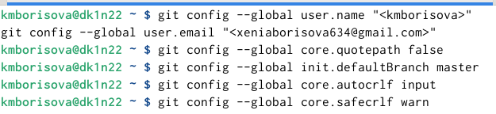
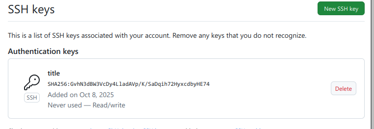
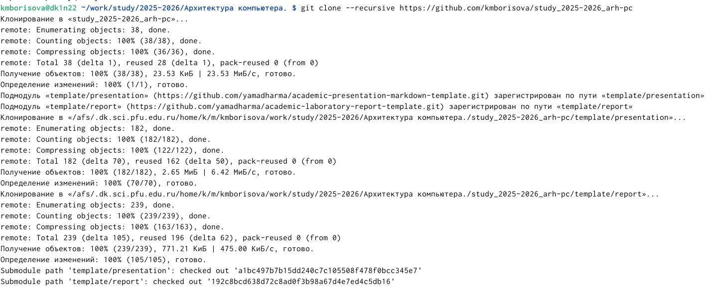
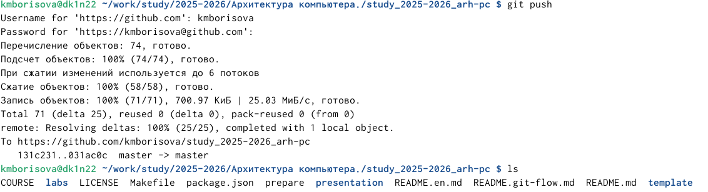
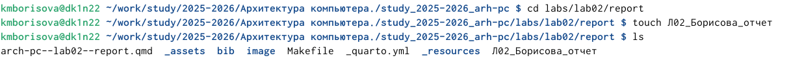
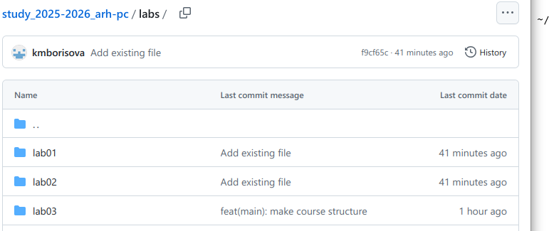
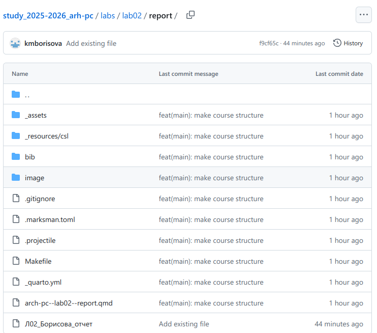

---
author:
  name: Борисова Ксения Михайловна
  degrees: НБИбд-01-25
  orcid: 1032253847
  email: 1032253847@pfur.ru
  affiliation:
    - name: Российский университет дружбы народов
      country: Российская Федерация
      postal-code: 117198
      city: Москва
      address: ул. Орджоникидзе, д. 3
title: "Лабораторная работеа №2"
subtitle: "Система контроля версий Git"
license: "Архитектура компьютеров и операционные системы"
editor: 
  markdown: 
    wrap: 72
---

# Цель работы

изучение идеологии и применения средств контроля версий, приобретение
практических навыков по работе с системой контроля версий git.

# Задание

1.  Создайте отчет по выполнению лабораторной работы в соответствующем
    каталоге рабочего пространства (labs/lab02/report).
2.  Скопируйте отчеты по выполнению предыдущих лабораторных работ в
    соответствующие каталоги созданного рабочего пространства.
3.  Загрузите файлы на github

# Теоретическое введение

Системы контроля версий (Version Control System, VCS) применяются при
работе нескольких человек над одним проектом. Обычно основное дерево
проекта хранится в локальном или удалённом репозитории, к которому
настроен доступ для участников проекта. При внесении изменений в
содержание проекта система контроля версий позволяет их фиксировать,
совмещать изменения, произведённые разными участниками проекта,
производить откат к любой более ранней версии проекта, если это
требуется. В классических системах контроля версий используется
централизованная модель, предполагающая наличие единого репозитория для
хранения файлов. Выполнение большинства функций по управлению версиями
осуществляется специальным сервером. Участник проекта (пользователь)
перед началом работы посредством определённых команд получает нужную ему
версию файлов. После внесения изменений пользователь размещает новую
версию в хранилище. При этом предыдущие версии не удаляются из
центрального хранилища и к ним можно вернуться в любой момент. Сервер
может сохранять не полную версию изменённых файлов, а производить так
называемую дельта-компрессию — сохранять только изменения между
последовательными версиями, что позволяет уменьшить объём хранимых
данных. Системы контроля версий поддерживают возможность отслеживания и
разрешения конфликтов, которые могут возникнуть при работе нескольких
человек над одним файлом. Можно объединить (слить) изменения, сделанные
разными участниками (автоматически или вручную), вручную выбрать нужную
версию, отменить изменения вовсе или заблокировать файлы для изменения.
В зависимости от настроек блокировка не позволяет другим пользователям
получить рабочую копию или препятствует изменению рабочей копии файла
средствами файловой системы ОС, обеспечивая, таким образом,
привилегированный доступ только одному пользователю, работающему с
файлом. Системы контроля версий также могут обеспечивать дополнительные,
более гибкие функциональные возможности. Например, они могут
поддерживать работу с несколькими версиями одного файла, сохраняя общую
историю изменений до точки ветвления версий и собственные истории
изменений каждой ветви. Кроме того, обычно доступна информация о том,
кто из участников, когда и какие изменения вносил. Обычно такого рода
информация хранится в журнале изменений, доступ к которому можно
ограничить. В отличие от классических в распределённых системах контроля
версий центральный репозиторий не является обязательным. Среди
классических VCS наиболее известны CVS, Subversion, а среди
распределённых —Git, Bazaar, Mercurial. Принципы их работы схожи,
отличаются они в основном синтаксисом используемых в работе команд.
2.2.2. Система контроля версий Git Система контроля версий Git
представляет собой набор программ командной строки. Доступ к ним можно
получить из терминала посредством ввода команды git с различными
опциями. Благодаря тому, что Git является распределённой системой
контроля версий, резервную копию локального хранилища можно сделать
простым копированием или архивацией. 2.2.3. Основные команды git
Наиболее часто используемые команды git представлены в табл. ??. Таблица
2.1. Основные команды git Команда Описание git init создание основного
дерева репозитория git pull получение обновлений (изменений) текущего
дерева из центрального репозитория git push отправка всех произведённых
изменений локального дерева в центральный репозиторий git status
просмотр списка изменённых файлов в текущей директории git diff просмотр
текущих изменений git add . добавить все изменённые и/или созданные
файлы и/или каталоги 20 Архитектура компьютеров Команда Описание git add
имена_файлов добавить конкретные изменённые и/или созданные файлы и/или
каталоги git rm имена_файлов удалить файл и/или каталог из индекса
репозитория (при этом файл и/или каталог остаётся в локальной
директории) git commit -am 'Описание коммита' сохранить все добавленные
изменения и все изменённые файлы git checkout -b имя_ветки создание
новой ветки, базирующейся на текущей git checkout имя_ветки переключение
на некоторую ветку (при переключении на ветку, которой ещё нет в
локальном репозитории, она будет создана и связана с удалённой) git push
origin имя_ветки отправка изменений конкретной ветки в центральный
репозиторий git merge --no-ff имя_ветки слияние ветки с текущим деревом
git branch -d имя_ветки удаление локальной уже слитой с основным деревом
ветки git branch -D имя_ветки принудительное удаление локальной ветки
git push origin :имя_ветки удаление ветки с центрального репозитория
2.2.4. Стандартные процедуры работы при наличии центрального репозитория
Работа пользователя со своей веткой начинается с проверки и получения
изменений из центрального репозитория (при этом в локальное дерево до
начала этой процедуры не должно было вноситься изменений): git checkout
master git pull git checkout -b и При необходимости удаляем лишние
файлы, которые не хотим отправлять в центральный репозиторий. Затем
полезно просмотреть текст изменений на предмет соответствия правилам
ведения чистых коммитов: git diff Если какие-либо файлы не должны
попасть в коммит, то помечаем только те файлы, изме- нения которых нужно
сохранить. Для этого используем команды добавления и/или удаления с
нужными опциями: git add имена_файлов git rm имена_файлов Если нужно
сохранить все изменения в текущем каталоге, то используем: git add .
Затем сохраняем изменения, поясняя, что было сделано: git commit -am
"Some commit message" и отправляем в центральный репозиторий: git push
origin имя_ветки или git push

# Выполнение лабораторной работы

Выполнение лабораторной работы.

1.Настройка github.

Создаю учётную запись на сайте https://github.com/ и заполняю основные
данные.

{#fig-001}

2.Базовая настройка git.

Сначала сделаем предварительную конфигурацию git. Открываю терминал и
ввожу следующие команды, указав свое имя и e-mail. Настраиваю utf-8 в
выводе сообщений git. Задаю имя начальной ветки (будем называть её
master). Задаю параметр autocrlf и safecrlf.

{#fig-002}

3.  Создание SSH-ключа.

Сгенерировала пару ключей (приватный и открытый) для последующей
идентификации на сервере репозиториев. Сохранила ключи в каталоге
\~/keys.\

{#fig-003}

Загружаю сгенерированный открытый ключ на сайт http://github.org/ под
своей учётной записью.

{#fig-004}

Копирую из локальной консоли ключ в буфер обмена и указываю имя ключа.

{#fig-005}

4.  Создание рабочего пространства и репозитория курса на основе
    шаблона. Открываю терминал и создаю каталог для предмета
    «Архитектура компьютера».

{#fig-006}

5.  Создание репозитория курса на основе шаблона. Перехожу на станицу
    репозитория с шаблоном курса https://github.com/yamadharma/cour
    se-directory-student-template. Далее выбираю Use this template. В
    открывшемся окне задаю имя репозитория: study_2025–2026_arh-pc и
    создаю репозиторий. Открываю терминал и перехожу в каталог курса.

{#fig-007}

Клонирую созданный репозиторий.

{#fig-008}

6.  Настройка каталога курса. Перехожу в каталог курса и создаю
    необходимые каталоги: echo arch-pc \> COURSE make prepare. Отправляю
    файлы на сервер.

{#fig-009}

{#fig-010}

Проверяю правильность создания иерархии рабочего пространства на
странице github.

{#fig-011}

7.  Задание для самостоятельной работы. 1.Перехожу в каталог
    labs/lab02/report. Создаю в нем файл для отчета лабараторной работы
    №2.Проверяю,создались ли файлы.

{#fig-012}

2.  Скопировала отчет по выполнению предыдущей лабораторной работы в
    соответствующий каталог созданного рабочего пространства. Создаю
    коммит отчеты по двум лабараторным работам. Сохраняю изменения на
    сервере, отправляю изменения в репозиторий.

{#fig-013}

{#fig-014}

Перехожу в githab и проверяю, правильно ли выполнились задания.

{#fig-015}

Проверяю, находятся ли отчеты в соответствующих папках.

{#fig-016}

# Выводы

В ходе выполнения лабораторной работы я приобрела практические знания
пользования системой github. Разобрала команды clone, add, commit, push.
Изучила структуру системы и научилась разбираться в ней.

# Список литературы {.unnumbered}

туис
