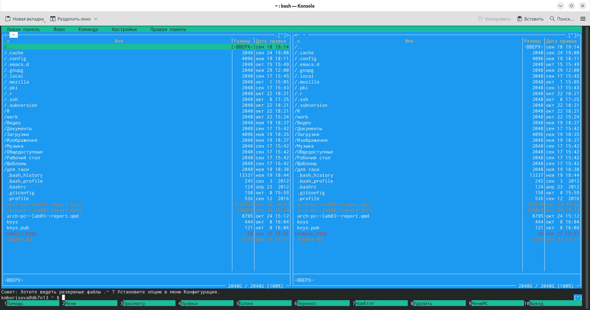
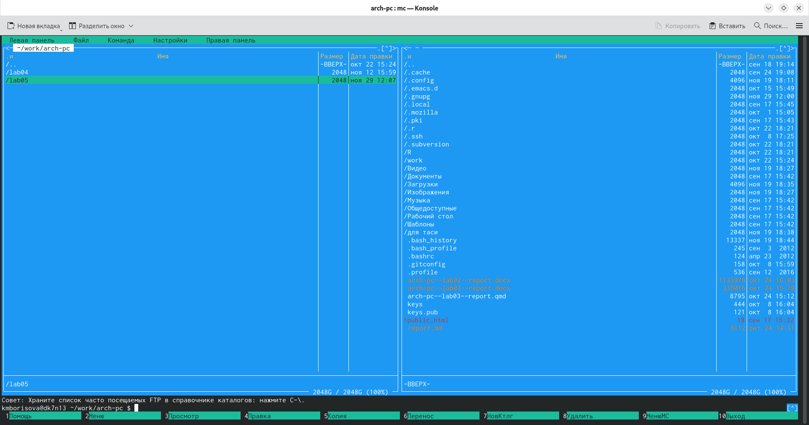
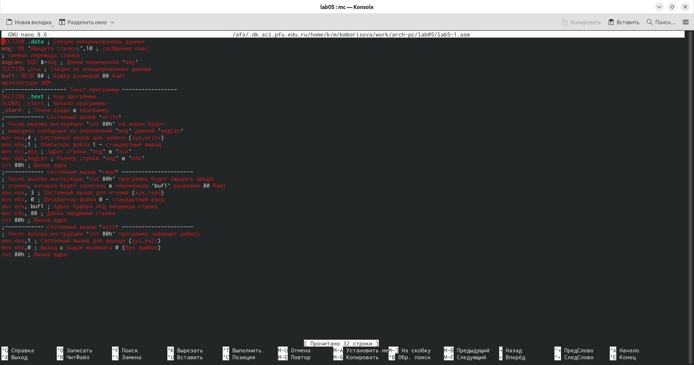
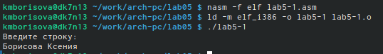
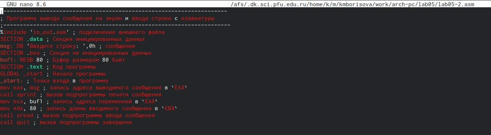
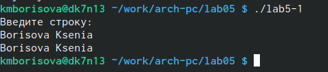
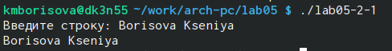

---
author:
  name: Борисова Ксения Михайловна
  degrees: НБИ-01-25
  orcid: 1032253847
  email: 1032253847@pfur.ru
  affiliation:
    - name: Российский университет дружбы народов
      country: Российская Федерация
      postal-code: 115419
      city: Москва
      address: ул. Орджоникидзе, д. 4
title: "Лабораторная работа №5"
subtitle: "Архитектура компьютеров и операционные системы."
license: "Структура программы на языке ассемблера NASM. Системные вызовы в ОС GNU Linux"
editor: 
  markdown: 
    wrap: 72
---

# Цель работы

Приобретение практических навыков работы в Midnight Commander. Освоение
инструкций языка ассемблера mov и int.

# Задание

1.  Создайте копию файла lab5-1.asm. Внесите изменения в программу (без
    использования внешнего файла in_out.asm), так чтобы она работала по
    следующему алгоритму: • вывести приглашение типа “Введите строку:”;
    • ввести строку с клавиатуры; • вывести введённую строку на экран.
2.  Получите исполняемый файл и проверьте его работу. На приглашение
    ввести строку введите свою фамилию.
3.  Создайте копию файла lab5-2.asm. Исправьте текст программы с
    использование подпрограмм из внешнего файла in_out.asm, так чтобы
    она работала по следующему алгоритму: • вывести приглашение типа
    “Введите строку:”; • ввести строку с клавиатуры; • вывести введённую
    строку на экран

# Теоретическое введение

**5.2.1. Основы работы с Midnight Commander** Midnight Commander (или
просто mc) — это программа, которая позволяет просматривать структуру
каталогов и выполнять основные операции по управлению файловой системой,
т.е. mc является файловым менеджером. Midnight Commander позволяет
сделать работу с файлами более удобной и наглядной. Для активации
оболочки Midnight Commander достаточно ввести в командной строке mc и
нажать клавишу Enter. В Midnight Commander используются функциональные
клавиши F1 — F10 , к которым привязаны часто выполняемые операции F1
вызов контекстно-зависимой подсказки F2 вызов меню, созданного
пользователем F3 просмотр файла, на который указывает подсветка в
активной панели F4 вызов встроенного редактора для файла, на который
указывает подсветка в активной панели F5 копирование файла или группы
отмеченных файлов из каталога, отображаемого в активной панели, в
каталог, отображаемый на второй панели F6 перенос файла или группы
отмеченных файлов из каталога, отображаемого в активной панели, в
каталог, отображаемый на второй панели F7 создание подкаталога в
каталоге, отображаемом в активной панели F8 удаление файла (подкаталога)
или группы отмеченных файлов F9 вызов основного меню программы F10 выход
из программы Программа на языке ассемблера NASM, как правило, состоит из
трёх секций: секция кода программы (SECTION .text), секция
инициированных (известных во время компиляции) данных (SECTION .data) и
секция неинициализированных данных (тех, под которые во время компиляции
только отводится память, а значение присваивается в ходе выполнения
программы) (SECTION .bss). Для объявления инициированных данных в секции
.data используются директивы DB, DW, DD, DQ и DT, которые резервируют
память и указывают, какие значения должны храниться в этой памяти: • DB
(define byte) — определяет переменную размером в 1 байт; • DW (define
word) — определяет переменную размеров в 2 байта (слово); • DD (define
double word) — определяет переменную размером в 4 байта (двойное слово);
• DQ (define quad word)— определяет переменную размером в 8 байт
(учетверённое слово); • DT (define ten bytes) — определяет переменную
размером в 10 байт. Директивы используются для объявления простых
переменных и для объявления массивов. Для определения строк принято
использовать директиву DB в связи с особенностями хранения данных в
оперативной памяти. Синтаксис директив определения данных следующий:
<имя> DB <операнд> \[, <операнд>\] \[, <операнд>\] Для объявления
неинициированных данных в секции .bss используются директивы resb, resw,
resd и другие, которые сообщают ассемблеру, что необходимо
зарезервировать заданное количество ячеек памяти.

**5.2.3. Элементы программирования**

**5.2.3.1. Описание инструкции mov**

Инструкция языка ассемблера mov предназначена для дублирования данных
источника в приёмнике. В общем виде эта инструкция записывается в виде
mov dst,src Здесь операнд dst — приёмник, а src — источник. В качестве
операнда могут выступать регистры (register), ячейки памяти (memory) и
непосредственные значения (const).
ВАЖНО! Переслать значение из
одной ячейки памяти в другую нельзя, для этого необходимо использовать
две инструкции mov: mov eax, x mov y, eax Также необходимо учитывать то,
что размер операндов приемника и источника должны совпадать.
Использование слудующих примеров приведет к ошибке: • mov al,1000h —
ошибка, попытка записать 2-байтное число в 1-байтный регистр; • mov
eax,cx — ошибка, размеры операндов не совпадают.

**5.2.3.2. Описание инструкции int**

Инструкция языка ассемблера intпредназначена для вызова прерывания с
указанным номером. В общем виде она записывается в виде int n Здесь n —
номер прерывания, принадлежащий диапазону 0–255. При программировании в
Linux с использованием вызовов ядра sys_calls n=80h (принято задавать в
шестнадцатеричной системе счисления). После вызова инструкции int 80h
выполняется системный вызов какой-либо функции ядра Linux. При этом
происходит передача управления ядру операционной системы. Чтобы узнать,
какую именно системную функцию нужно выполнить, ядро извлекает номер
системного вызова из регистра eax. Поэтому перед вызовом прерывания
необходимо поместить в этот регистр нужный номер. Кроме того, многим
системным функциям требуется передавать какие-либо параметры. По
принятым в ОС Linux правилам эти параметры помещаются в порядке
следования в остальные регистры процессора: ebx, ecx, edx. Если
системная функция должна вернуть значение, то она помещает его в регистр
eax.

**5.2.3.3. Системные вызовы для обеспечения диалога с пользователем**

Простейший диалог с пользователем требует наличия двух функций — вывода
текста на экран и ввода текста с клавиатуры. Простейший способ вывести
строку на экран — использовать системный вызов write. Этот системный
вызов имеет номер 4, поэтому перед вызовом инструкции int необходимо
поместить значение 4 в регистр eax. Первым аргументом write, помещаемым
в регистр ebx, задаётся дескриптор файла. Для вывода на экран в качестве
дескриптора файла нужно указать 1 (это означает «стандартный вывод», т.
е. вывод на экран). Вторым аргументом задаётся адрес выводимой строки
(помещаем его в регистр ecx, например, инструкцией mov ecx, msg). Строка
может иметь любую длину. Последним аргументом (т.е. в регистре edx)
должна задаваться максимальная длина выводимой строки. Для ввода строки
с клавиатуры можно использовать аналогичный системный вызов read. Его
аргументы –такие же, как у вызова write,только для «чтения» с клавиатуры
используется файловый дескриптор 0 (стандартный ввод). Системный вызов
exit является обязательным в конце любой программы на языке ассемблер.
Для обозначения конца программы перед вызовом инструкции int 80h
необходимо поместить в регистр еах значение 1, а в регистр ebx код
завершения 0.

# Выполнение лабораторной работы

Открываю Midnight Commander

{#fig-001}

Пользуясь клавишами ↑ , ↓ и Enter перехожу в каталог \~/work/arch-pc
созданный при выполнении лабораторной работы №4. С помощью
функциональной клавиши F7 создаю папку lab05.

{#fig-002}

Пользуясь строкой ввода и командой touch создаю файл lab5-1.asm. С
помощью функциональной клавиши F4 открываю файл lab5-1.asm для
редактирования во встроенном редакторе.Ввожу текст программы из
листинга, сохраняю изменения и закрываю файл.

{#fig-003}

Оттранслировала текст программы lab5-1.asm в объектный файл. Выполняю
компоновку объектного файла и запускаю получившийся исполняемый файл.

{#fig-004}

С помощью функциональной клавиши F6 создаю копию файла lab5-1.asm с
именем lab5-2.asm. Исправляю текст программы в файле lab5-2.asm с
использование подпрограмм из внешнего файла in_out.asm. Создаю
исполняемый файл и проверяю его работу.

{#fig-005}

# Выполнение самостоятельной работы

1.  Создаю копию файла lab5-1.asm. Вношу изменения в программу (без
    использования внешнего файла in_out.asm), так чтобы она работала по
    следующему алгоритму: • вывести приглашение типа “Введите строку:”;
    • ввести строку с клавиатуры; • вывести введённую строку на экран.
2.  Получаю исполняемый файл и проверяю его работу. На приглашение ввожу
    свои фамилию и имя

{#fig-006}

3.  Создаю копию файла lab5-2.asm. Исправляю текст программы с
    использованием подпрограмм из внешнего файла in_out.asm, так чтобы
    она работала по следующему алгоритму: • вывести приглашение типа
    “Введите строку:”; • ввести строку с клавиатуры; • вывести введённую
    строку на экран.

    {#fig-007}

# Выводы

В ходе выполнения работы, я приобрела практические навыки работы в
Midnight Commander ,а также освоила инструкции языка ассемблера mov и
int.

# Список литературы

ТУИС \[Архитектура ЭВМ 5. Лабораторная работа №5. Структура программы на
языке ассемблера NASM. Системные вызовы в ОС GNU Linux\]
