---
author:
  name: Борисова Ксения Михайловна
  degrees: НБИ-01-25
  orcid: 1032253847
  email: 1032253847@pfur.ru
  affiliation:
    - name: Российский университет дружбы народов
      country: Российская Федерация
      postal-code: 115419
      city: Москва
      address: ул. Орджоникидзе, д. 4
title: "Лабораторная работа №6"
subtitle: "Архитектура компьютеров и операционные системы."
license: "Арифметические операции в NASM."
editor: 
  markdown: 
    wrap: 72
---

# Цель работы

Освоение арифметических инструкций языка ассемблера NASM. \# Задание

1.  Написать программу вычисления выражения 𝑦 = 𝑓(𝑥). Программа должна
    выводить выражение для вычисления, выводить запрос на ввод значения
    𝑥, вычислять заданное выражение в зависимости от введенного 𝑥,
    выводить результат вычислений. Вид функции 𝑓(𝑥) выбрать из таблицы
    6.3 вариантов заданий в соответствии с номером полученным при
    выполнении лабораторной работы. Создайте исполняемый файл ипроверьте
    его работу для значений 𝑥1 и 𝑥2 из 6.3

# Теоретическое введение

**6.2.1. Адресация в NASM** Большинство инструкций на языке ассемблера
требуют обработки операндов. Адрес операнда предоставляет место, где
хранятся данные, подлежащие обработке. Это могут быть данные хранящиеся
в регистре или в ячейке памяти. Далее рассмотрены все существующие
способы задания адреса хранения операндов – способы адресации.
Существует три основных способа адресации: • Регистровая адресация –
операнды хранятся в регистрах и в команде используются имена этих
регистров, например: mov ax,bx. • Непосредственная адресация – значение
операнда задается непосредственно в команде, Например: mov ax,2. •
Адресация памяти – операнд задает адрес в памяти. В команде указывается
символическое обозначение ячейки памяти, над содержимым которой
требуется выполнить операцию. Например, определим переменную intg DD 3 –
это означает, что задается область памяти размером 4 байта, адрес
которой обозначен меткой intg. В таком случае, команда mov eax,\[intg\]
копирует из памяти по адресу intg данные в регистр eax. В свою очередь
команда mov \[intg\],eax запишет в память по адресу intg данные из
регистра eax. Также рассмотрим команду mov eax,intg В этом случае в
регистр eax запишется адрес intg. Допустим, для intg выделена память
начиная с ячейки с адресом 0x600144, тогда команда mov eax,intg
аналогична команде mov eax,0x600144 – т.е. эта команда запишет в регистр
eax число 0x600144.

**6.2.2. Арифметические операции в NASM**

**6.2.2.1. Целочисленное сложение add.**

Схема команды целочисленного сложения add (от англ. addition -
добавление) выполняет сложение двух операндов и записывает результат по
адресу первого операнда. Команда add работает как с числами со знаком,
так и без знака и выглядит следующим образом: add <операнд_1>,
<операнд_2> Допустимые сочетания операндов для команды add аналогичны
сочетаниям операндов для команды mov. Так, например, команда add eax,ebx
прибавит значение из регистра eax к значению из регистра ebx и запишет
результат в регистр eax. Примеры: add ax,5 ; AX = AX + 5 add dx,cx ; DX
= DX + CX add dx,cl ; Ошибка: разный размер операндов.

**6.2.2.2.2 Целочисленное вычитание sub.**

Команда целочисленного вычитания sub (от англ. subtraction – вычитание)
работает аналогично команде add и выглядит следующим образом: sub
<операнд_1>, <операнд_2> Так, например, команда sub ebx,5 уменьшает
значение регистра ebx на 5 и записывает результат в регистр ebx.

**6.2.2.3.Команды инкремента и декремента.**

Довольно часто при написании программ встречается операция прибавления
или вычитания единицы. Прибавление единицы называется инкрементом, а
вычитание — декрементом. Для этих операций существуют специальные
команды: inc (от англ. increment) и dec (от англ. decrement), которые
увеличивают и уменьшают на 1 свой операнд. Эти команды содержат один
операнд и имеет следующий вид: inc <операнд> dec <операнд> Операндом
может быть регистр или ячейка памяти любого размера. Команды инкремента
и декремента выгодны тем, что они занимают меньше места, чем
соответствующие команды сложения и вычитания. Так, например, команда inc
ebx увеличивает значение регистра ebx на 1, а команда inc ax уменьшает
значение регистра ax на 1.

**6.2.2.4. Команда изменения знака операнда neg.**

Еще одна команда, которую можно отнести к арифметическим командам это
команда изменения знака neg: neg <операнд> Команда neg рассматривает
свой операнд как число со знаком и меняет знак операнда на
противоположный. Операндом может быть регистр или ячейка памяти любого
размера. mov ax,1 ; AX = 1 neg ax ; AX = -1 6.2.2.5. Команды умножения
mul и imul. Умножение и деление, в отличии от сложения и вычитания, для
знаковых и беззнаковых чисел производиться по-разному, поэтому
существуют различные команды. Для беззнакового умножения используется
команда mul (от англ. multiply – умножение): mul <операнд> Для знакового
умножения используется команда imul: imul <операнд> Для команд умножения
один из сомножителей указывается в команде и должен находиться в
регистре или в памяти, но не может быть непосредственным операндом.
Второй сомножитель в команде явно не указывается и должен находиться в
регистре EAX,AX или AL, а результат помещается в регистры EDX:EAX, DX:AX
или AX, в зависимости от размера операнда. Регистры используемые
командами умножения в Nasm Размер операнда Неявный множитель Результат
умножения 1 байт AL AX 2 байта AX DX:AX 4 байта EAX EDX:EAX Пример
использования инструкции mul: a dw 270 mov ax, 100 ; AX = 100 mul a ; AX
= AX*a, mul bl ; AX = AL*BL mul ax ; DX:AX = AX\*AX

**6.2.2.5. Команды деления div и idiv.**

Для деления, как и для умножения, существует 2 команды div (от англ.
divide - деление) и idiv: div <делитель> ; Беззнаковое деление idiv
<делитель> ; Знаковое деление В командах указывается только один операнд
– делитель, который может быть регистром или ячейкой памяти, но не может
быть непосредственным операндом. Местоположение делимого и результата
для команд деления зависит от размера делителя. Кроме того, так как в
результате деления получается два числа – частное и остаток, то эти
числа помещаются в определённые регистры. Регистры используемые
командами деления в Nasm Размер операнда (делителя) Делимое Частное
Остаток 1 байт AX AL AH 2 байта DX:AX AX DX 4 байта EDX:EAX EAX EDX
Например, после выполнения инструкций mov ax,31 mov dl,15 div dl
результат 2 (31/15) будет записан в регистр al, а остаток 1 (остаток от
деления 31/15) — в регистр ah. Если делитель — это слово (16-бит), то
делимое должно записываться в регистрах dx:ax. Так в результате
выполнения инструкций mov ax,2 ; загрузить в регистровую mov dx,1 ; пару
`dx:ax` значение 10002h mov bx,10h div bx в регистр ax запишется частное
1000h (результат деления 10002h на 10h), а в регистр dx — 2 (остаток от
деления).

**6.2.3. Перевод символа числа в десятичную символьную запись** Ввод
информации с клавиатуры и вывод её на экран осуществляется в символьном
виде. Кодирование этой информации производится согласно кодовой таблице
символов ASCII. ASCII – сокращение от American Standard Code for
Information Interchange (Американский стандартный код для обмена
информацией). Согласно стандарту ASCII каждый символ кодируется одним
байтом. Расширенная таблица ASCII состоит из двух частей. Первая
(символы с кодами 0-127) является универсальной (см. Приложение.), а
вторая (коды 128-255) предназначена для специальных символов и букв
национальных алфавитов и на компьютерах разных типов может меняться.
Среди инструкций NASM нет такой, которая выводит числа (не в символьном
виде). Поэтому, например, чтобы вывести число, надо предварительно
преобразовать его цифры в ASCII-коды этих цифр и выводить на экран эти
коды, а не само число. Если же выводить число на экран непосредственно,
то экран воспримет его не как число, а как последовательность
ASCII-символов – каждый байт числа будет воспринят как один ASCII-символ
– и выведет на экран эти символы. Аналогичная ситуация происходит и при
вводе данных с клавиатуры. Введенные данные будут представлять собой
символы, что сделает невозможным получение корректного результата при
выполнении над ними арифметических операций. Для решения этой проблемы
необходимо проводить преобразование ASCII символов в числа и обратно.
Для выполнения лабораторных работ в файле in_out.asm реализованы
подпрограммы для преобразования ASCII символов в числа и обратно. Это: •
iprint – вывод на экран чисел в формате ASCII, перед вызовом iprint в
регистр eax необходимо записать выводимое число (mov eax,<int>). •
iprintLF – работает аналогично iprint, но при выводе на экран после
числа добавляет к символ перевода строки. • atoi – функция преобразует
ascii-код символа в целое число и записает результат в регистр eax,
перед вызовом atoi в регистр eax необходимо записать число (mov
eax,<int>)

# Выполнение лабораторной работы

Создаю каталог для программам лабораторной работы № 6, перехожу в него и
создаю файл lab6-1.asm

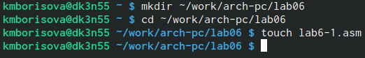{#fig-001}

Введите в файл lab6-1.asm текст программы из листинга 6.1.

{#fig-002}

Создаю исполняемый файл и запускаю его

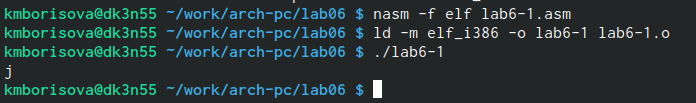{#fig-003}

Изменяю текст программы и вместо символов записываю в регистры числа.
Исправляю текст программы (Листинг 6.1) следующим образом: заменяю
строки mov eax,'6' mov ebx,'4' на строки mov eax,6 mov ebx,4

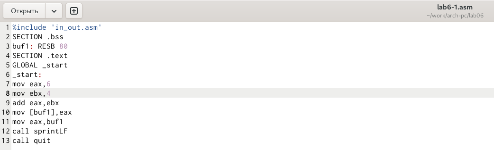{#fig-004}

Создайте исполняемый файл и запустите его.

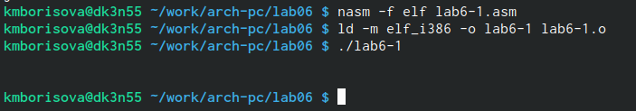{#fig-005}

Создаю файл lab6-2.asm в каталоге \~/work/arch-pc/lab06 и ввожу в него
текст программы из листинга 6.2.

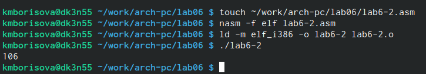{#fig-006}

Изменяю символы на числа. Создаю исполняемый файл и запускаю его.

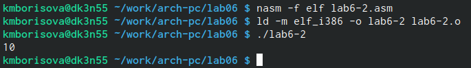{#fig-007}

Заменяю функцию iprintLF на iprint. Создаю исполняемый файл и запускаю
его.

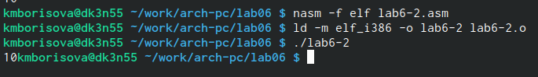{#fig-008}

Создаю файл lab6-3.asm в каталоге \~/work/arch-pc/lab06. Внимательно
изучаю текст программы из листинга 6.3 и ввожу в lab6-3.asm.

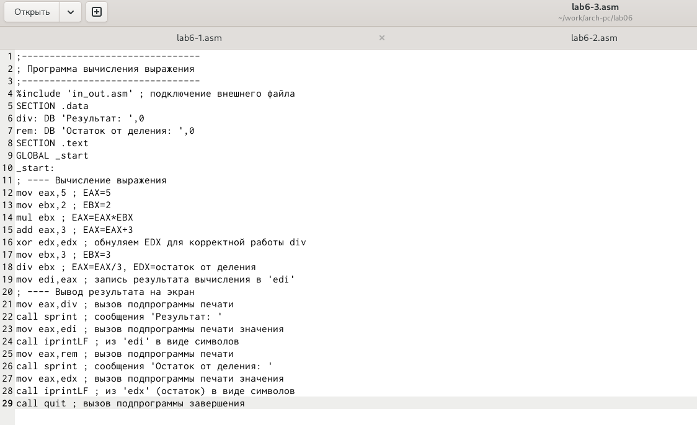{#fig-0019

Создаю исполняемый файл и запускаю его.

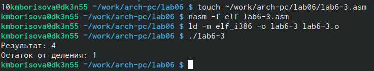{#fig-010}

Изменяю текст программы для вычисления выражения 𝑓(𝑥) = (4 ∗ 6 + 2)/5.

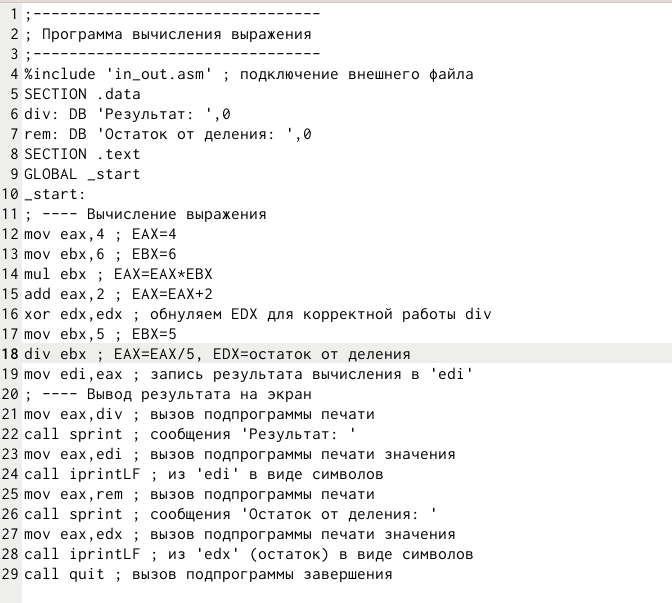{#fig-011}

Создаю исполняемый файл и запускаю его.

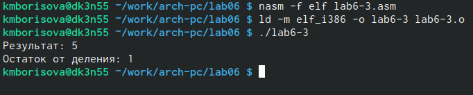{#fig-012}

Создаю файл variant.asm в каталоге \~/work/arch-pc/lab06. Внимательно
изучаю текст программы из листинга 6.4 и ввожу в файл variant.asm.
Создаю исполняемый файл и запускаю его.

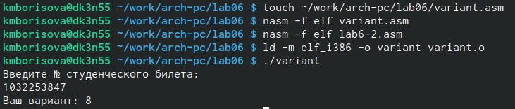{#fig-013}

**Ответы на вопросы по программе**

```         
1. За вывод сообщения “Ваш вариант” отвечают строки кода:
```

mov eax,rem call sprint 2. Инструкция mov ecx, x используется, чтобы
положить адрес вводимой строки x в регистр ecx mov edx, 80 - запись в
регистр edx длины вводимой строки call sread - вызов подпрограммы из
внешнего файла, обеспечивающей ввод сообщения с клавиатуры 3. call atoi
используется для вызова подпрограммы из внешнего файла, которая
преобразует ascii-код символа в целое число и записывает результат в
регистр eax 4. За вычисления варианта отвечают строки: xor edx,edx ;
обнуление edx для корректной работы div mov ebx,20 ; ebx = 20 div ebx ;
eax = eax/20, edx - остаток от деления inc edx ; edx = edx + 1 5. При
выполнении инструкции div ebx остаток от деления записывается в регистр
edx 6. Инструкция inc edx увеличивает значение регистра edx на 1 7. За
вывод на экран результатов вычислений отвечают строки: mov eax,edx call
iprintLF

**Выполнение самостоятельной работы**

Пишу программу для вычисления выражения под номером своего
варианта,который я узнала при выполнении прошлого задания (8)

\![рис 1\]4(image/14.png){#fig-014}

# Выводы

При выполнении данной лабораторной работы я освоила арифметические
инструкции языка ассемблера NASM.

# Список литературы

```         
1. Лабораторная работа №6
2. Таблица ASCII
```
